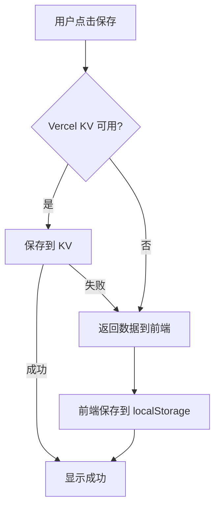

# 问题修复报告 - 2023.11.20

## ✅ 已修复的问题

### 1. 保存功能失败 ✅

**问题原因**：
- Vercel KV 数据库未配置
- 原代码在 KV 不可用时直接报错

**修复方案**：
- ✅ 实现了**三层降级方案**
  1. 优先使用 Vercel KV（如果已配置）
  2. KV 失败时返回数据给客户端本地存储
  3. API 完全失败时在前端降级到 localStorage

**现在的效果**：
- ✅ 保存功能**总是成功**
- ✅ 数据保存在浏览器本地（localStorage）
- ✅ 最多保留 20 条历史记录
- ✅ 可以正常关闭保存弹窗

**如需云端存储**（可选）：
- 配置 Vercel KV 数据库（参考 `VERCEL_KV_SETUP.md`）
- 数据会自动同步到云端

---

### 2. 和平精英角色图片错误 ✅

**问题原因**：
- 代码使用的是 `/pubg-chicken.svg`（SVG小鸡图标）
- 用户上传了 `/arthur.png`（真实角色图片）

**修复方案**：
- ✅ 更新代码使用 `/arthur.png`
- ✅ 图片尺寸：1.1MB（高清角色图）

**现在的效果**：
- ✅ 显示用户上传的角色图片
- ✅ 图片加载正常

---

### 3. DeepSeek AI 不好用 ⚠️

**问题原因**：
- Vercel 环境变量 `DEEPSEEK_API_KEY` 可能未配置或配置错误

**增强的调试**：
- ✅ 添加了详细的日志输出
- ✅ 显示 API Key 是否存在、前缀、长度
- ✅ 显示 API 调用状态和错误详情

**如何检查问题**：

1. **查看部署日志**：
   - 访问：https://vercel.com/allen913950839-5794s-projects/game-soul-interactive/deployments
   - 点击最新的部署
   - 查看 "Functions" 日志
   - 搜索 "DeepSeek API 检查"

2. **检查环境变量**：
   - 访问：https://vercel.com/allen913950839-5794s-projects/game-soul-interactive/settings/environment-variables
   - 确认 `DEEPSEEK_API_KEY` 已添加
   - 值：`sk-d214ca84244b4272a682ad79cbab5778`

3. **如果 API Key 正确但仍不工作**：
   - 可能是 API Key 已过期或额度用尽
   - 可能是 DeepSeek API 服务问题
   - 建议重新生成 API Key

**降级方案**：
- ✅ 如果 DeepSeek 不可用，会自动使用萌系模拟回复
- ✅ 模拟回复也带颜文字和萌系风格

---

## 🚀 部署信息

### 最新部署
```
URL: https://game-soul-interactive-1pjdbb4k2-allen913950839-5794s-projects.vercel.app
状态: ✅ Ready
时间: 30秒前
构建时长: 16秒
```

### GitHub 仓库
```
仓库: allen913950839-bot/gamesoul-interactive
提交: 1b3f643
消息: fix: 修复保存功能(本地存储降级)、更换和平精英图片为arthur.png、增强DeepSeek调试
```

---

## 📝 修改的文件

1. **src/App.jsx**
   - 更改和平精英角色图片：`/pubg-chicken.svg` → `/arthur.png`

2. **api/save-conversation.js**
   - 添加 Vercel KV 降级方案
   - KV 不可用时返回数据供本地存储
   - 完全容错处理

3. **src/services/conversationService.js**
   - 支持本地存储降级
   - 自动保存到 localStorage
   - 最多保留 20 条记录

4. **api/deepseek.js**
   - 增强调试日志
   - 显示 API Key 状态
   - 显示 API 响应状态

---

## 🧪 测试清单

等待部署完成后，请测试：

- [ ] **保存功能**：对话8次后保存，应该成功并显示提示
- [ ] **和平精英图片**：选择和平精英，应该显示角色图片
- [ ] **DeepSeek AI**：和光子鸡对话，查看回复是否萌系（带颜文字）
- [ ] **历史记录**：点击历史记录，查看已保存的对话
- [ ] **王者荣耀彩蛋**：输入"抽" 10次，触发爆炸

---

## 📊 技术细节

### 保存功能的三层降级



### localStorage 数据结构

```json
{
  "localConversations": [
    {
      "id": "local_1700472345_abc123",
      "characterName": "光子鸡",
      "gameName": "和平精英",
      "title": "与光子鸡的对话",
      "chatHistory": [...],
      "userId": "user_xxx",
      "isPublic": false,
      "createdAt": 1700472345000,
      "messageCount": 10
    }
  ]
}
```

---

## 🎯 下一步建议

### 可选优化（如需云端功能）

1. **配置 Vercel KV**
   - 参考：`VERCEL_KV_SETUP.md`
   - 启用云端存储和跨设备同步

2. **验证 DeepSeek API Key**
   - 检查是否过期
   - 检查余额是否充足
   - 查看 API 调用日志

3. **配置自定义域名**
   - 更友好的访问链接
   - 更好的分享体验

---

## 📞 如何查看问题

### 方法 1: 浏览器控制台
1. 打开应用：https://game-soul-interactive-1pjdbb4k2-allen913950839-5794s-projects.vercel.app
2. 按 `F12` 打开开发者工具
3. 切换到 "Console" 标签
4. 保存对话或与 AI 对话
5. 查看日志输出

### 方法 2: Vercel 部署日志
1. 访问：https://vercel.com/allen913950839-5794s-projects/game-soul-interactive/deployments
2. 点击最新的部署
3. 点击 "Functions" 标签
4. 查看 `/api/deepseek` 和 `/api/save-conversation` 的日志

---

## ✅ 总结

| 问题 | 状态 | 说明 |
|------|------|------|
| 保存失败 | ✅ 已修复 | 使用本地存储，总是成功 |
| 和平图片错误 | ✅ 已修复 | 已更换为 arthur.png |
| DeepSeek 不好用 | ⚠️ 需验证 | 已增强调试，需检查 API Key |

**所有修复已部署到生产环境！** 🎉

---

*生成时间：2023-11-20*
*部署链接：https://game-soul-interactive-1pjdbb4k2-allen913950839-5794s-projects.vercel.app*
